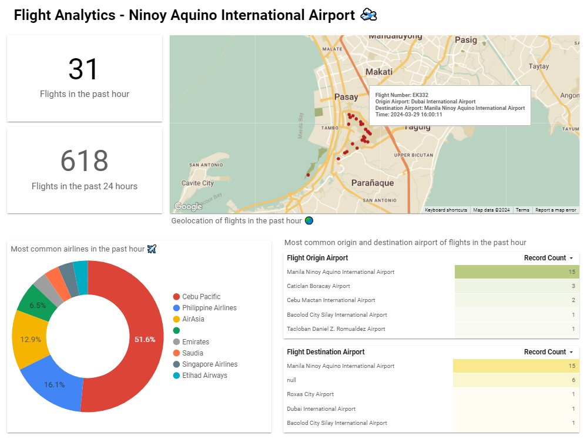
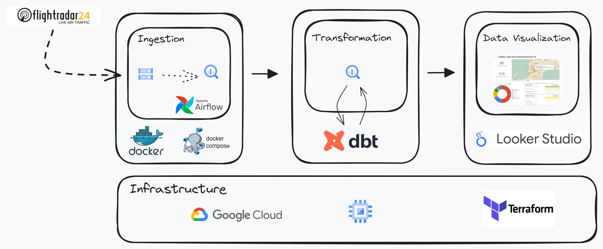

# Flight Analytics 🛫

Flight Analytics is an end-to-end data pipeline that serves hourly and daily flight analytics over Ninoy Aquino International Airport (NAIA) and  displays metrics such as number of flights, the most common airlines, and the most common origin and destination airport of flights in the past hour. The location or bounded area can be configured but by default the pipeline pulls flight data around NAIA.

## Preview 🌏

[See Dashboard](https://lookerstudio.google.com/reporting/b45cbd84-1db9-46cb-b454-6db393eb282e)

## Tech Stack 👨‍💻

This pipeline is hosted on Google Cloud Platform (GCP) and utilizes the following technologies:
- Data source: FlightRadar24 API
- Cloud: Google Cloud Platform, Compute Engine
- Data Lake: GCS Bucket
- Data Warehouse: BigQuery
- Orchestrator: Airflow in Docker
- Data Transformation: dbt
- Data Viz: Google Looker Studio
- Infrastructure as Code (IaC): Terraform

## Architecture 👷

## Data Pipeline 🔧

1. The data is fetched from [FlightRadar24 API](https://fr24api.flightradar24.com/docs) through [FlightRadarAPI](https://pypi.org/project/FlightRadarAPI/). Flight data in the bounded area is ingested every 15 minutes and stored in a Google Cloud Storage bucket.
2. Every hour, two Airflow DAGs will process these files in the data lake and load them into BigQuery as external tables. One will process hourly flight data and another one for processing flight data in the past 24 hours. 
3. A dbt Cloud job will then process these raw hourly and daily external tables into production tables ready for analytic querying by performing SQL transformations such as joining them to external airlines and airports lookup tables.
4. Both hourly and daily production tables are then loaded to Google Looker Studio to display metrics such as number of flights in the past hour or day, most common airlines and the most common origin and destination airports of flights in the past hour.
5. Data is kept for 3 days in the Google Cloud Storage bucket before it is deleted through a lifecycle management policy to reduce costs.

## Setup 🛠️
1. Setting up the [Google Cloud Project](guides/GCP_setup.md).
2. Setup the GCP Compute Engine [VM instance](guides/GCP_Compute_Engine_VM_setup.md) and cloning the project repo.
3. Create the Google Cloud Storage bucket and BigQuery datasets though [terraform](guides/Terraform_GCS_bucket_BQ_dataset_setup.md).
4. Setting up [airflow configurations](guides/Airflow_Docker_setup.md) in docker.
5. Setup your dbt Cloud project and the [dbt Cloud job](guides/dbt_Cloud_setup.md).

## Possible Improvements 💡
- Terraforming the creation of the Compute Engine VM instance.
- Use dbt Core instead of dbt Cloud to integrate dbt with Airflow seamlessly.
- ~~Implement data quality checks that ensures data consistency and correctness in the pipeline.~~
- Expanding project scope by covering flight data in more regions or airports in the Philippines.